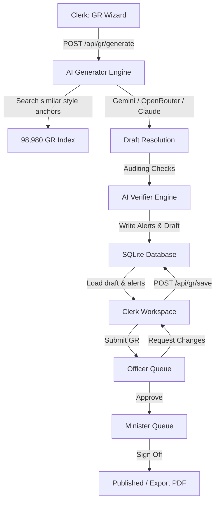

# MAHARASHTRA GR-Align 🏛️

### Government Resolution Intelligence & Compliance Platform

MAHA-GR-ALIGN is a production-grade, AI-powered Government Resolution (GR) management platform built for the Government of Maharashtra. It enables junior clerks to draft resolutions under the guidance of a pre-trained compliance engine, allows senior officers to verify and forward resolutions within a 30-second card review interface, and gives ministers the ability to sign off and publish official resolutions.

The compliance engine queries and validates drafts against a real-time historical database containing **98,980 actual Maharashtra Government Resolutions** (2021–2026) across 33 government departments.

---

## 🚀 Key Features

### 1. **No-Mock Compliance Auditing (98,980 Historical Base)**
* Runs real-time verification checks on draft resolutions against the parsed index of 98,980 actual resolutions.
* **Deprecated Account Heads**: Checks the last 2 years of parsed GRs in the matching department to flag retired account codes.
* **Budget Ceiling Violations**: Calculates the mathematical average budget of matching historical GRs from the database and flags proposals that exceed the average by $2\times$ or more.
* **Policy Contradictions**: Scans subjects of actual historical GRs in the department to flag potential overrides or overlapping mandates.
* **Jurisdiction Validation**: Automatically flags if the department has no historical footprint in the assigned district.

### 2. **Bilingual Style AI Generation**
* Pulls the 3 most similar prior resolutions from the database index and passes them as reference templates to the LLM.
* Generates structured markdown drafts containing all official headers, legal language, references, resolution clauses, and sign-off sections.
* **Supports 100% Free AI Tiers**:
  * **Google Gemini Flash** (`gemini-1.5-flash` via Google AI Studio key) for high-speed, free-tier generation.
  * **OpenRouter Free Models** (`meta-llama/llama-3-8b-instruct:free` or `google/gemma-2-9b-it:free`) for zero-cost generation.
  * **Claude API** (`claude-3-5-sonnet`) for advanced sonnet generation.

### 3. **Role-Based Workflow Queues**
* **Junior Clerk**: Fills in the 3-step creation wizard (Intent, District, Subject, Budget, Account Head). Refines drafts inside a split-screen workspace featuring inline code editors and automated compliance feedback cards.
* **Senior Officer**: Accesses the pending review queue (`pending_approval` GRs) with a 30-second scannable dashboard summary. Approves and forwards to the Minister, or rejects with comments.
* **Minister**: Accesses the final signature queue (`pending_signature` GRs) for one-click approval, moving resolutions to published status (`approved`).
* **Comments loop**: Returned GRs appear in the Clerk's dashboard with status `rejected` and the reviewer's feedback visible.

### 4. **Historical Database Search**
* Built directly on the dashboard landing page.
* Type topics or keywords (e.g., *solar*, *grant*, *scheme*, *school*) and filter by the 33 departments to query the 98,980 GR database.

### 5. **Bilingual Styled Prints & Exports**
* Standardized print-friendly templates resembling official Maharashtra Government Resolutions (emblem header, reference lists, signature blocks).
* Supports printing natively to PDF via browser print layouts.

---

## 📊 System Architecture



---

## 🛠️ Setup & Initialization

### 1. Install Dependencies
Ensure you have Node.js v18+ installed. From the project root, run:
```bash
npm install
```

### 2. Set Up Environment Variables
Create a `.env` file in the root directory. You can choose to configure one of the free AI model routes:

```env
# Port & Environment
PORT=5000
NODE_ENV=development

# OPTION A: Google Gemini Free Tier (ai.google.dev)
GEMINI_API_KEY=your_gemini_api_key_here
GEMINI_MODEL=gemini-1.5-flash

# OPTION B: OpenRouter Free Models (openrouter.ai)
# OPENROUTER_API_KEY=your_openrouter_api_key_here
# OPENROUTER_MODEL=meta-llama/llama-3-8b-instruct:free

# OPTION C: Claude API (console.anthropic.com)
# ANTHROPIC_API_KEY=your_anthropic_api_key_here
```

### 3. Start the Backend Server
The server parses all 98,980 historical `.txt` files and builds memory indexes in ~2 seconds once files are read:
```bash
npm run server
```
*Backend runs on: `http://localhost:5000`*

### 4. Start the Frontend Client
In a separate terminal window, launch the Vite dev server:
```bash
npm run dev
```
*Frontend runs on: `http://localhost:5173`*

---

## 📋 Step-by-Step Testing Workflow

To evaluate the system end-to-end using the **Role Switcher** in the header:

1. **Switch to Clerk**:
   * Navigate to **Create GR**.
   * Fill out the details (e.g., Department: *Finance*, Subject: *Solar Subsidies*, Budget: *₹50,000,000*, Account Head: *2071-00-101*).
   * Click **Generate GR**. Once generated, check the **Verification Results** box.
   * Click **Proceed to Workspace**. Edit sections, save, and review active audit alerts.
   * Click **Submit for Review** (GR enters `pending_approval` status).

2. **Switch to Senior Officer**:
   * Navigate to **Executive Review** or click the dashboard review button.
   * Select the GR from the queue.
   * Review compliance alerts.
   * Click **Approve** (GR enters `pending_signature` status).

3. **Switch to Minister**:
   * Select the GR from the Minister's dashboard signature queue.
   * Click **Sign Off** (GR status becomes `approved` / Published).

4. **Print and Save**:
   * Click **View HTML/PDF** on the published list.
   * Click **Print Resolution** to save as PDF.
